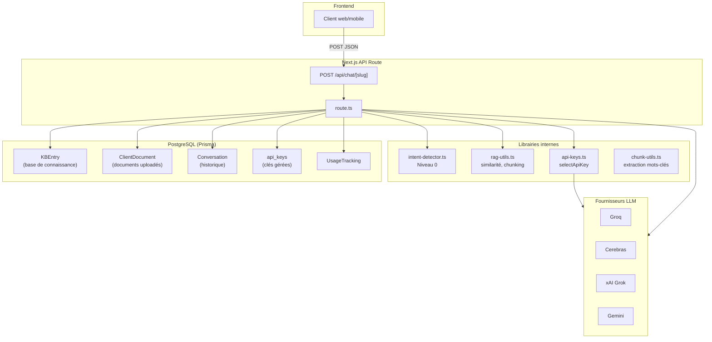
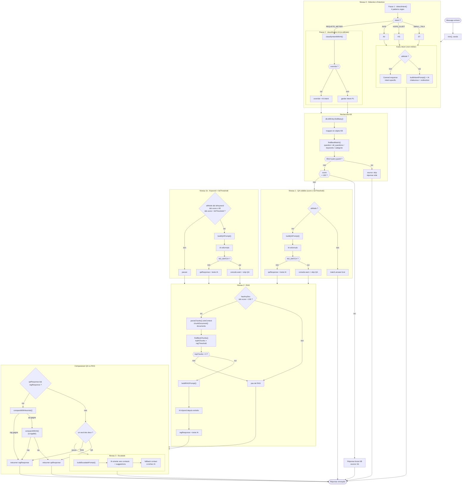
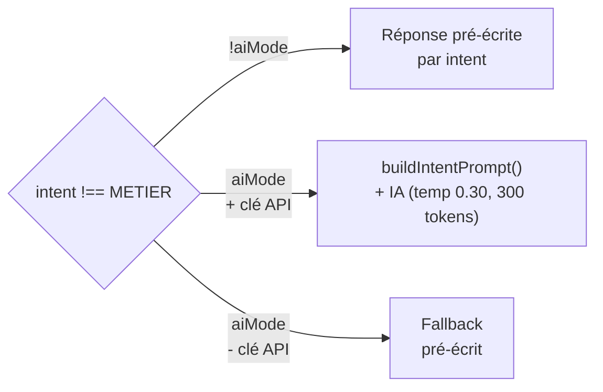
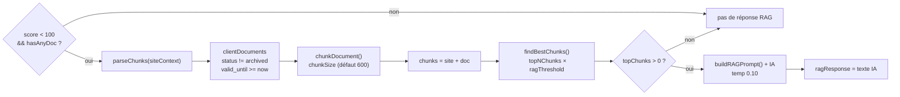
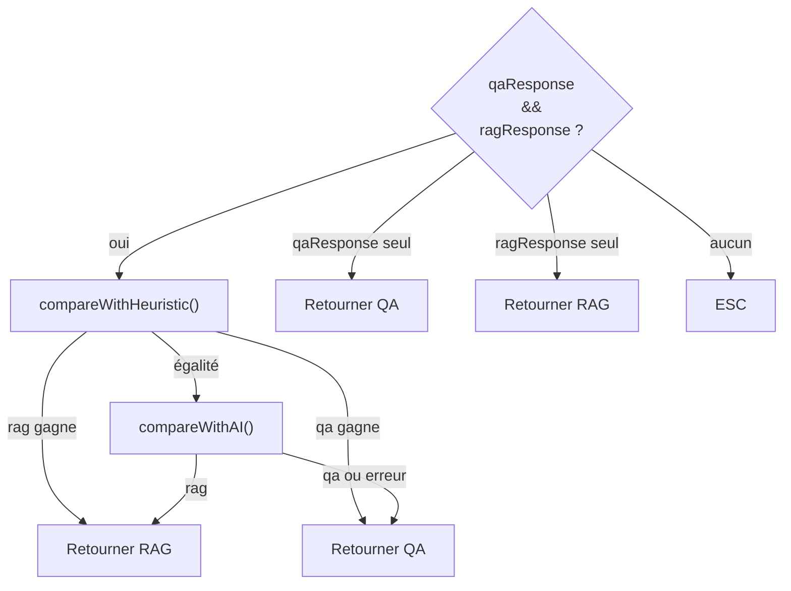
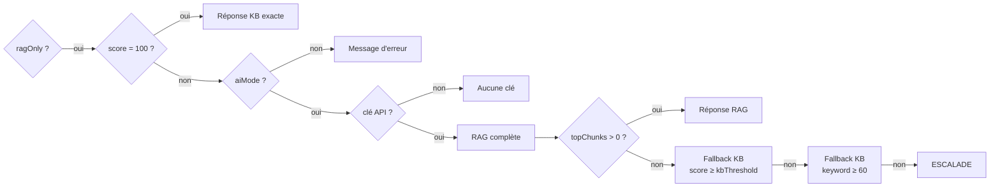

# Architecture du chatbot CETIM — Flux interne

## 1. Architecture globale



---

## 2. Pipeline complet d'une requête



---

## 3. Niveau 0 — Détection d'intention

### Passe 1 : Regex (`detectIntent` dans `intent-detector.ts`)

4 catégories testées dans l'ordre :

| Catégorie | Fichier | Confiance |
|---|---|---|
| `SMALL_TALK` | `SMALL_TALK_PATTERNS` | 1.0 |
| `HORS_SUJET` | `HORS_SUJET_PATTERNS` | 0.9 |
| `AVIS` | `AVIS_PATTERNS` | 0.9 |
| `REQUETE_METIER` | (aucun pattern, catch-all) | 1.0 |

**Fichier :** `src/lib/intent-messages.ts`

```ts
// SMALL_TALK_PATTERNS – match début de phrase
{ regex: /^(bonjour|salut|cc|hello|coucou|hey|salam|slt)\b/i },
{ regex: /^(merci|thanks|shukran)\b/i },
{ regex: /^(au revoir|bye|bonne journée|bonne soirée)\b/i },
{ regex: /^(ok|d'accord|compris|pas de souci)\b/i },
{ regex: /^(comment (ça va|vas-tu)|ça va(\s|[?]|$))/i },
// ... (17 patterns au total)

// HORS_SUJET_PATTERNS – match dans tout le message
{ regex: /(météo|temps qu'il fait|pluie|soleil)\b/i },
{ regex: /(recette|cuisiner|manger|repas)\b/i },
{ regex: /(football|foot|sport|match)\b/i },
{ regex: /(politique|élection|président|gouvernement)\b/i },
// ... (10 patterns au total)

// AVIS_PATTERNS – match dans tout le message
{ regex: /(j'adore|j aime|j'aime)\s+(cetim|votre|ce site)\b/i },
{ regex: /(je n'aime pas|je déteste)\s+(cetim|votre|le bot)\b/i },
```

### Passe 2 : Classification IA (`classifyIntentWithAI` dans `intent-detector.ts`)

Appelée **après Passe 1** si `aiMode === true`. L'IA peut **override** le résultat de Passe 1 (que ce soit faux positif ou faux négatif).

**Prompt :**
```
System:
Tu es un classifieur d'intention. Réponds UNIQUEMENT par un seul mot :
SALUTATION, HORS_SUJET, AVIS, ou METIER.

SALUTATION = salutations, remerciements, au revoir, small talk, comment ça va, qui es-tu
HORS_SUJET = questions sans rapport avec les activités techniques, normes, essais, laboratoires
AVIS = expression d'opinion sur CETIM, ses services, le chatbot (j'aime, je n'aime pas, c'est bien/nul)
METIER = tout ce qui concerne le CETIM, ses services techniques, essais, normes, certifications,
         formations, laboratoires, inspection, métrologie, géotechnique, organisation, direction,
         contact, informations générales

User:
Message: "{message}"
Classification :
```

**Paramètres :** temp=0, max_tokens=10, model=client.aiModel ou "openai/gpt-oss-20b"

### Early return (intent ≠ REQUETE_METIER)



**Prompt Intention (aiMode) :** `buildIntentPrompt`

```
System:
Tu es l'assistant officiel de {client}.{contexte}

RÈGLES :
[règles selon l'intent : SMALL_TALK / AVIS / HORS_SUJET]
- Réponds toujours en français, chaleureux et professionnel
- Termine par une question ouverte sur ses besoins CETIM

User:
{message brut}
```

---

## 4. KB Matching — `findBestMatch`

```mermaid
flowchart TD
  QUERY[("Question<br/>utilisateur")] --> INIT["bestScore = 0<br/>best = null"]
  INIT --> LOOP{["Pour chaque entrée KB"]}

  LOOP --> Q["calcSimilarity(query, question)"]
  Q --> Q_CMP{"> bestScore<br/>ou (= et priority > best) ?"}
  Q_CMP -->|oui| SETQ["best = entry<br/>isKeyword = false"]
  Q_CMP -->|non| ALT

  SETQ --> ALT

  ALT["Boucle alt_questions]"]
  ALT --> ALT_CMP{"> bestScore<br/>ou (= et priority > best) ?"}
  ALT_CMP -->|oui| SETALT["best = entry<br/>isKeyword = false"]
  ALT_CMP -->|non| KW

  SETALT --> KW

  KW["Boucle keywords"]
  KW --> KW_REGEX["kwRegex = \\bkeyword\\b<br/>test(query normée)"]
  KW_REGEX --> KW_CMP{"match &&<br/>(0.6 > bestScore<br/>ou (= et priority > best)) ?"}
  KW_CMP -->|oui| SETKW["best = entry<br/>score = 0.6<br/>isKeyword = true"]
  KW_CMP -->|non| CAT

  SETKW --> CAT

  CAT["catégorie"]
  CAT --> CAT_REGEX["catRegex = \\bcat\\b<br/>test(query normée)"]
  CAT_REGEX --> CAT_CMP{"match &&<br/>(0.55 > bestScore<br/>ou (= et priority > best)) ?"}
  CAT_CMP -->|oui| SETCAT["best = entry<br/>score = 0.55<br/>isKeyword = false"]
  CAT_CMP -->|non| NEXT

  SETCAT --> NEXT

  NEXT{"Encore des<br/>entrées ?"}
  NEXT -->|oui| LOOP
  NEXT -->|non| END["return {match, score, isKeyword}"]

  END --> GUARD
```

### Scores seuils

| Condition | `kbThreshold` |
|---|---|
| `isKeyword === true` | **50** |
| `isKeyword === false` | `client.kbThreshold ?? 80` |

### Short query guard

```
si (1 mot ≤ 4 caractères OU ≤ 3 caractères au total)
  ET (pas de match OU score < max(kbThreshold, 80))
  ALORS retourner réponse vide (source: "skip")
```

Ne bloque PAS si le match est un mot-clé (`isKeyword = true`) pour éviter de couper les requêtes comme "pdg".

---

## 5. Niveaux 1 & 1b — QA Reformulation

### Niveau 1 : score ≥ kbThreshold

```
si score === 100
  → retourner match.answer directement (exact match, pas d'IA)
si !aiMode
  → retourner match.answer directement
sinon
  → buildQAPrompt() + IA (temp 0.05, même modèle)
```

### Niveau 1b : isKeyword && score ≥ 60 && score < kbThreshold

```
si aiMode && isKeyword && match?.answer && score ≥ 60 && score < kbThreshold
  → buildQAPrompt() + IA (temp 0.05)
```

### Prompt QA commun (N1 & N1b)

**Fonction :** `buildQAPrompt` dans `route.ts`

```
System:
Tu es l'assistant officiel de {client}.
Tu reformules UNIQUEMENT une réponse validée issue de la base de connaissance.
{contexte}

RÈGLES ABSOLUES :
- Ne modifie PAS le fond, les chiffres, les délais ou les références
- Reformule légèrement l'introduction et la transition, mais conserve
  le contenu structuré (listes, tableaux, puces)
- Conserve les emojis, le gras, les listes numérotées et les tableaux markdown
- Réponds toujours en français, professionnel et concis
- Si un document source est disponible pour téléchargement, inclus un lien
  cliquable markdown : [Télécharger le fichier](URL)
- Termine par : [Source : Base de connaissance {client}]
- Si la RÉPONSE OFFICIELLE ne répond PAS à la QUESTION DU CLIENT,
  réponds UNIQUEMENT par le mot exact : NO_MATCH

User:
NIVEAU : QA VALIDÉE (score {score}%)

RÉPONSE OFFICIELLE À UTILISER :
{match.answer}

LIEN DU DOCUMENT SOURCE :
{match.source_url || "Aucun"}

QUESTION DU CLIENT :
{question}
```

### Traitement de NO_MATCH

```
si IA répond "NO_MATCH" (insensible à la casse)
  → console.warn avec tag/score/message
  → NE PAS set qaResponse → le flow continue vers RAG ou Escalade
sinon
  → set qaResponse = texte IA → utilisé en sortie
```

---

## 6. Niveau 2 — RAG documentaire



### Prompt RAG

**Fonction :** `buildRAGPrompt` dans `route.ts`

```
System:
Tu es l'assistant officiel de {client}.
Tu réponds en te basant UNIQUEMENT sur les extraits de documentation ci-dessous.
{contexte}

RÈGLES ABSOLUES :
- Ne réponds qu'à partir des extraits fournis
- Si les extraits ne répondent que partiellement, réponds avec
  les informations disponibles
- En cas de contradiction entre extraits, privilégie le plus récent
  ou le plus spécifique
- Les extraits sont classés par pertinence : l'extrait #1 est le plus important
- Si AUCUN extrait ne répond à la question, dis-le poliment
- N'invente JAMAIS d'information
- Réponds toujours en français, professionnel et concis
- Termine par : [Source documentaire : {sources}]
- Ajoute : "Cette réponse est basée sur la documentation disponible.
  Pour confirmation officielle, contactez un expert."

User:
NIVEAU : RAG DOCUMENTAIRE

DOCUMENTS CONSULTÉS (classés par pertinence) :
{ranking}

EXTRAITS DISPONIBLES :
{docs}

QUESTION DU CLIENT :
{question}
```

---

## 7. Comparaison QA vs RAG

Quand les deux réponses existent (`qaResponse && ragResponse`) :



---

## 8. Niveau 3 — Escalade

Utilisé quand aucun niveau précédent n'a produit de réponse.

### Prompt Escalade

**Fonction :** `buildEscaladePrompt` dans `route.ts`

```
System:
Tu es un assistant professionnel de {client}.
Tu n'as pas trouvé de réponse précise. Tu orientes le client
vers les bonnes ressources.
{contexte}

EXEMPLE DE RÉPONSE ATTENDUE :
Client : "Quels sont les tarifs des essais ?"
Assistant :
"Je n'ai pas trouvé de réponse précise à votre question dans
notre base de connaissances.

Pour obtenir un devis personnalisé, vous pouvez contacter notre équipe :
📞 Tél. : 023 58 70 70
📧 Email : contact@cetim-dz.com

Vous pouvez également consulter notre catalogue de prestations ou nous
préciser le type d'essai qui vous intéresse (béton, sol, eau, etc.).

Puis-je vous aider avec autre chose ?"

RÈGLES ABSOLUES :
- Suis le format de l'exemple ci-dessus : 1) phrase d'ouverture,
  2) coordonnées, 3) suggestions, 4) question ouverte
- Reste courtois, neutre et professionnel
- Utilise les INFORMATIONS DE CONTACT réelles ci-dessous
- Suggère 2-3 questions pertinentes en lien avec la QUESTION DU CLIENT
- N'invente JAMAIS d'information technique
- Réponds toujours en français, ton professionnel et accessible
- Ne te présente PAS comme "conseiller commercial"

User:
NIVEAU : ESCALADE — AUCUN CONTEXTE PERTINENT

PROFIL : {sessionType}

INFORMATIONS DE CONTACT :
{contactInfo}

QUESTION DU CLIENT :
{question}
```

**Paramètres :** temp=0.20, max_tokens=800

---

## 9. Mode ragOnly

Quand `ragOnly = true`, le flux ignore la KB (sauf score=100 exact) et va directement en RAG :



---

## 10. Décisions de conception

| Décision | Alternative | Pourquoi ce choix |
|---|---|---|
| **PostgreSQL + Prisma** | SQLite, MongoDB | Scalabilité (Neon serverless), relations entre tables, typage fort Prisma |
| **2 passes de classification (N0)** | Regex uniquement ou IA uniquement | Regex = 0 coût, rapide pour 90% des cas ; IA = flexible pour les cas ambigus. La Passe 2 peut corriger les faux positifs ET faux négatifs |
| **Keyword matching par word boundaries** | `includes()`, regex libre | Évite les faux positifs ("laboratoire" ne matche pas "labo" et vice-versa sans être dans les keywords) |
| **Score mot-clé fixe à 0.6** | Score variable | Simple et efficace : un mot-clé présent dans la question = lien fort garanti |
| **Seuil keyword = 50** | Seuil unique 80 | Les mots-clés sont plus fiables que la similarité textuelle : un match mot-clé mérite un seuil plus bas |
| **Priorité variable (5-10)** | Ordre d'insertion | Permet aux entrées spécifiques (PDG=10, labos=10) de gagner contre les généralistes (presentation=5) |
| **Pipeline progressif (KB → RAG → Escalade)** | Routage fixe, un seul niveau | Graceful degradation : si la KB a la réponse, pas besoin de RAG (coût). Si la RAG échoue, Escalade |
| **NO_MATCH** | Ignorer, toujours reformuler | L'IA valide la pertinence après matching. Si hors-sujet, pas de fausse réponse : le système continue au niveau suivant |
| **Comparaison QA vs RAG (heuristique + IA)** | Un seul system | Quand les deux produisent une réponse, l'heuristique (rapide) choisit. En cas d'égalité, l'IA départage (précis) |
| **Chunking + similarité sémantique (RAG)** | Recherche full-text | Meilleur rappel pour des documents hétérogènes (PDF techniques, listes, tableaux) |
| **classifyIntentWithAI + 2026-07-03** | Date fixe | Prompt d'exemple inclut la date pour guider le format. (Note : adapté à la version actuelle) |

---

*Document généré le 03/07/2026 — reflet du code en production (commit `b1668e0` + `f5bc665`)*
