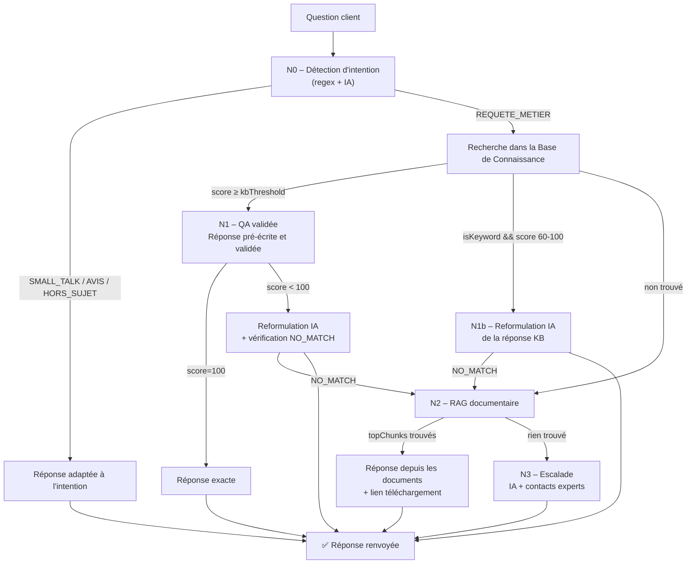

# Nova Chat — Assistant virtuel CETIM

---

## Slide 1 — Titre


**Nova Chat — Assistant virtuel CETIM Algérie**

Plateforme d'intelligence artificielle au service des équipes et des clients

---

## Slide 2 — Pourquoi un chatbot CETIM ?

### Intérêt pour l'entreprise

| Bénéfice | Impact |
|---|---|
| Réponse instantanée 24/7 | Clients servis même en dehors des horaires ouvrés |
| Réduction de charge | Les équipes techniques et commerciales sont moins sollicitées sur les questions récurrentes |
| Uniformité des réponses | Fin des informations contradictoires entre téléphone, email et site web |
| Capitalisation du savoir | La connaissance ne part plus avec les départs ou les mutations |

### Intérêt pour les collaborateurs

- **Outil de pré-qualification** : le client arrive déjà informé, les échanges sont plus efficaces
- **Base centralisée** : toute l'équipe répond avec les mêmes données à jour, validées par les experts
- **Auto-documentation** : les réponses métier sont écrites par les experts métier, pas par l'informatique
- **Temps libéré** : moins de temps passé à répéter les mêmes réponses → plus de temps pour les dossiers complexes

---

## Slide 3 — Principe de fonctionnement : architecture à 3 niveaux



### Principe de réponse

| Niveau | Déclencheur | Source | Précision |
|---|---|---|---|
| **N0** | Intention non-métier | Patterns regex + IA | Canned ou IA |
| **N1** | Score ≥ seuil (défaut 80) | Base de connaissance | Maximale |
| **N1b** | Mot-clé matché (score 60-99) | KB + reformulation IA | Haute |
| **N2 (RAG)** | Score < seuil + documents disponibles | Documents uploadés | Variable |
| **N3** | Aucune source trouvée | IA + contacts experts | Redirection |

### Filet de sécurité NO_MATCH

Si l'IA détecte que la réponse KB ne correspond pas à la question, elle répond `NO_MATCH` et le système descend automatiquement au niveau suivant (RAG ou Escalade). Cela évite les réponses hors-sujet.

---

## Slide 4 — Fonctionnalités de la plateforme

### Pour l'administrateur / le validateur

| Page | Fonctionnalités |
|---|---|
| **Base de connaissances** (`/app/kb`) | CRUD complet, recherche, filtre par catégorie, import/export JSON, export PDF, priorité (1-10), icônes, questions alternatives, mots-clés |
| **Paramètres > Configuration IA** | Seuils QA (N1) et RAG (N2), température par niveau, relance IA active/désactivée, texte de relance personnalisé |
| **Paramètres > Clés API** | Gestion des fournisseurs LLM (Groq, Cerebras, xAI, Gemini) |
| **Paramètres > Documents** | Upload fichiers (.txt, .csv, .json, .md), visualisation, téléchargement, suppression, date de validité, versionning, **Test RAG**, transfert vers KB |
| **Page Test** (`/app/test`) | Tester le chatbot en direct, voir la source et le score de chaque réponse |
| **Historique** | Conversations sauvegardées pour analyse |

### Pour l'utilisateur final (widget client)

- Interface de chat responsive (web et mobile)
- Réponses en français, professionnelles et concises
- Réponses sourcées (KB, RAG, Escalade)
- Liens de téléchargement cliquables pour les documents
- Suggestions de questions connexes
- Relance automatique après inactivité

---

## Slide 5 — Alimenter la base de connaissances

### Objectif : 90% de réponses automatiques sans escalade humaine

| Composant | Format | Effort | Couverture |
|---|---|---|---|
| **Entrées KB** | Question + réponse + mots-clés (via interface ou Excel) | Élevé (rédaction) | **60%** |
| **Documents RAG** | Fichiers texte (.txt, .csv, .json, .md) | Faible (upload) | **+30%** |
| **Escalade** | Contacts experts | Aucun | **10%** |

### Pour maîtriser la précision et le niveau de détail

- **Une question floue → une réponse précise** : le chatbot doit donner l'info exacte même si la question est vague
- **Priorité 10** = réponse très spécifique qui prime sur les généralistes (ex: "pdg" > "organigramme")
- **Questions alternatives** = toutes les façons de poser la même question (ex: "délai", "combien de temps", "durée", "quand")
- **Mots-clés** = matching par mot entier (`\bword\b`), insensible à la casse (ex: "labos" ne matche pas "laboratoire" — les deux doivent être dans les keywords)
- **Catégorie** = regroupe les entrées par domaine (permet le filtrage et les suggestions)

---

## Slide 6 — Fichier canevas Excel pour la KB

Un fichier Excel à remplir par les experts métier, importable directement dans la plateforme.

| Question | Réponse | Mots-clés | Catégorie | Priorité | Questions alternatives |
|---|---|---|---|---|---|
| Quel est le délai d'un essai compression sur béton ? | 7 à 14 jours ouvrés selon la cure. Le résultat est accompagné d'un certificat d'essai accrédité ALGERAC. | délai, compression, béton, essai, cure, certificat | Essais béton | 8 | combien de temps pour un essai béton, durée essai compression béton, quand aurai-je mon certificat béton |
| Qui est le PDG du CETIM ? | M. Lyes MADI — lm.cetim@gmail.com | pdg, lyes madi, directeur général, président directeur général | Direction | 10 | c'est qui le pdg, nom du directeur général, qui dirige le cetim |
| Quels sont les laboratoires du CETIM ? | 10 laboratoires : Ciment, Chimie, Bétons, Céramiques, Produits Rouges, Minéralogie, Plâtre/Chaux, Verres/Réfractaires, Analyse d'Eau, Géotechnique | labo, labos, liste, capacité, essai, spécialité, domaine | Laboratoires | 10 | liste des labos, quels labos, spécialités laboratoires |

### Règles d'or pour le fichier

- **Texte uniquement** : pas d'images, pas de tableaux complexes, pas de cellules fusionnées
- **Encodage UTF-8** : accents et caractères spéciaux supportés
- **Mots-clés séparés par des virgules** : l'ordre n'a pas d'importance
- **Questions alternatives séparées par `||`** : permet de couvrir tous les synonymes

---

## Slide 7 — Exemples concrets (avant / après)

### Exemple 1 : "Qui est le PDG du CETIM ?"

| État | Réponse |
|---|---|
| **Avant** (organigramme priorité 5) | 🗂️ Schéma organisationnel... DG → 4 directions → DTC → DAF *(pas de nom)* |
| **Après** (entrée `pdg_cetim` priorité 10) | 👤 **Président Directeur Général** — **M. Lyes MADI** — lm.cetim@gmail.com |

### Exemple 2 : "Quels sont les labos du CETIM ?"

| État | Réponse |
|---|---|
| **Avant** (présentation priorité 10) | 🏢 CETIM : Centre d'Études et de Services Technologiques... *(hors-sujet)* |
| **Après** (`presentation` 10→5, `laboratoires_liste` 10) | 🧪 **10 laboratoires** : Ciment, Bétons, Chimie, Céramiques, Produits Rouges, Minéralogie, Plâtre/Chaux, Verres/Réfractaires, Analyse d'Eau, Géotechnique |

### Exemple 3 : Requête courte "pdg"

- Match par mot-clé (score 60%)
- Seuil mot-clé = 50 → seuil passé
- Reformulation IA avec `buildQAPrompt` → réponse élégante mentionnant M. Lyes MADI
- Si l'IA détecte que la réponse ne correspond pas → `NO_MATCH` → redirection vers RAG

### Exemple 4 : Question avec salutation "Bonjour, qui est le PDG ?"

- Passe 1 (regex) : "Bonjour" → `SMALL_TALK`
- Passe 2 (IA) : analyse le message complet → `REQUETE_METIER` (override)
- Recherche KB → entrée `pdg_cetim` → réponse correcte

---

## Slide 8 — Formats supportés pour les documents RAG

| Format | Usage typique | Exemple |
|---|---|---|
| **.txt** | Notes, spécifications, listes | Note technique CETIM |
| **.csv** | Catalogues, tarifs, tableaux de données | Catalogue des prestations |
| **.json** | Données structurées, configurations | Export base de données |
| **.md** | Documentation, procédures, guides | Procédure d'essai |

### Règles

- **Texte uniquement** : pas d'images, pas de tableaux complexes (l'IA ne lit pas les cellules fusionnées, les colonnes multiples ou les PDF scannés)
- **Encodage UTF-8** obligatoire
- **Taille maximale** : 5 Mo par fichier
- **Date de validité** optionnelle : le document est automatiquement ignoré après expiration
- **Versionning** automatique : si le même nom de fichier est re-uploadé, la version est incrémentée

> Les fichiers sont chunkés automatiquement à l'upload (découpage par section, overlap 20%) et indexés pour la recherche RAG.

---

## Slide 9 — Test et validation : 100 questions

### Grille de test

Pour valider la couverture de la KB avant mise en production, un jeu de **100 questions tests** réparties par catégorie :

| Catégorie | Nb | Exemples de questions |
|---|---|---|
| **Présentation CETIM** | 10 | Qu'est-ce que le CETIM ? Où êtes-vous situés ? Depuis quand existez-vous ? Quel est votre statut ? |
| **Essais béton** | 15 | Quels essais faites-vous sur le béton ? Délai pour un essai de compression ? Norme utilisée ? Tarifs ? |
| **Essais sol / géotechnique** | 10 | Faites-vous des essais de sol ? Quels paramètres mesurez-vous ? Normes utilisées ? |
| **Analyse d'eau** | 10 | Quels paramètres analysez-vous ? Délai ? Tarifs ? Normes ? |
| **Métrologie / étalonnage** | 10 | Quels instruments étalonnez-vous ? Certificats ? Accréditation ? |
| **Ciments / céramiques** | 8 | Quels essais ciment ? Méthodes ? Normes ? |
| **Laboratoires** | 10 | Liste des labos ? Accréditations ? Contacts ? Horaires ? |
| **Direction / contact** | 10 | Qui est le PDG ? Contact commercial ? Contact technique ? Adresse ? |
| **Hors sujet** | 7 | Météo, foot, cuisine, politique → doit rediriger poliment |
| **Cas limites** | 10 | "oui", "bonjour", phrases très courtes, caractères spéciaux |

### Critères de validation

| Statut | Signification | Action |
|---|---|---|
| ✅ **N1 OK** | Réponse KB exacte ou reformulée, parfaitement adaptée | Aucune |
| ✅ **N1b OK** | Reformulation correcte, source mentionnée | Vérifier la qualité de la reformulation |
| ✅ **N2 OK** | Réponse documentée, lien téléchargeable présent | Vérifier la pertinence des chunks |
| ✅ **N3 OK** | Escalade vers le bon contact, suggestions pertinentes | Vérifier les contacts |
| ❌ **Échec** | Réponse hors-sujet, absurde ou absente | Corriger la KB, ajuster les mots-clés |

---

## Slide 10 — Workflow contribution

```
Expert métier                  Validateur                      Administrateur
─────────────                  ──────────                      ──────────────

   │                                │                              │
   ├─ Remplit le fichier            │                              │
   │  Excel ou saisit               │                              │
   │  dans l'interface KB           │                              │
   │                                │                              │
   │                                ├─ Teste les réponses          │
   │                                │  (page test + 100 Q)         │
   │                                │  Ajuste priorité,            │
   │                                │  mots-clés, catégorie        │
   │                                │                              │
   │                                │                              ├─ Valide les seuils
   │                                │                              │  Publie / active
   │                                │                              │
   ├─ Reçoit le feedback ───────────┤                              │
   │  Améliore les formulations     │                              │
   │                                │                              │
```

### Rôles et responsabilités

| Rôle | Qui | Actions |
|---|---|---|
| **Expert métier** | Techniciens, ingénieurs, commerciaux | Rédige les questions et réponses, définit les mots-clés et questions alternatives |
| **Validateur** | Chef de service, responsable qualité | Teste, ajuste les priorités, vérifie la couverture, fixe les dates de validité |
| **Administrateur** | DSI, responsable digital | Configure les seuils IA, gère les API keys, supervise le déploiement |

---

## Slide 11 — Suivi et amélioration continue

### Indicateurs de performance

| Métrique | Cible | Comment la mesurer |
|---|---|---|
| **Taux de réponse N1** | ≥ 60% | Dashboard (logs de conversation) |
| **Taux de réponse N1+N2** | ≥ 90% | Dashboard |
| **Taux d'escalade (N3)** | ≤ 10% | Dashboard |
| **Satisfaction utilisateur** | ≥ 4/5 | Enquête trimestrielle |
| **Temps de réponse moyen** | < 3s | Monitoring |

### Boucle d'amélioration

```
Logs d'escalade → Identifier les questions non couvertes → Créer les entrées KB manquantes
                                                                ↓
                                                    Tester et valider
                                                                ↓
                                              Mettre à jour les seuils si besoin
                                                                ↓
                                              → Retour aux logs (vérifier la baisse)
```

### Points d'attention

- Les logs `NO_MATCH` remontent les entrées KB dont la réponse ne correspond pas à la question → les corriger
- Un export mensuel de la KB permet la révision des priorités et des dates de validité
- Les documents uploadés avec une date de validité sont automatiquement exclus après expiration

---

## Slide 12 — Questions / Rappels clés

| Rappel | Détail |
|---|---|
| **Mots-clés ≠ mots dans la réponse** | Les mots-clés sont ce que l'utilisateur TAPE, pas ce qui est dans la réponse — ils doivent couvrir les synonymes et abréviations |
| **Priorité 10** | Réservé aux réponses très spécifiques qui doivent l'emporter sur les généralités (ex: PDG > organigramme) |
| **Pas d'embedding sémantique** | "délai de certification" ≠ "combien de temps pour obtenir un certificat" — ajouter des questions alternatives ou des mots-clés |
| **Un document mal chunké** | = réponse partielle ou hors contexte — utiliser le test RAG pour vérifier l'indexation |
| **Les fichiers texte uniquement** | L'IA lit le texte. Pas d'images, pas de PDF scannés, pas de tableaux complexes |
| **NO_MATCH** | Filet de sécurité : si l'IA voit que la réponse KB ne correspond pas, elle refuse et le système passe au niveau suivant |

---

*Document généré le 03/07/2026 — reflet de la version `23dd162` du code*
